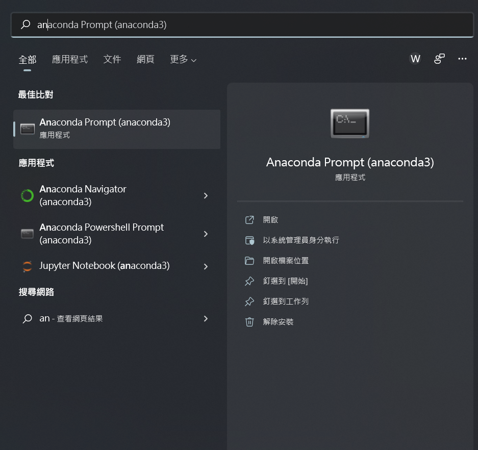
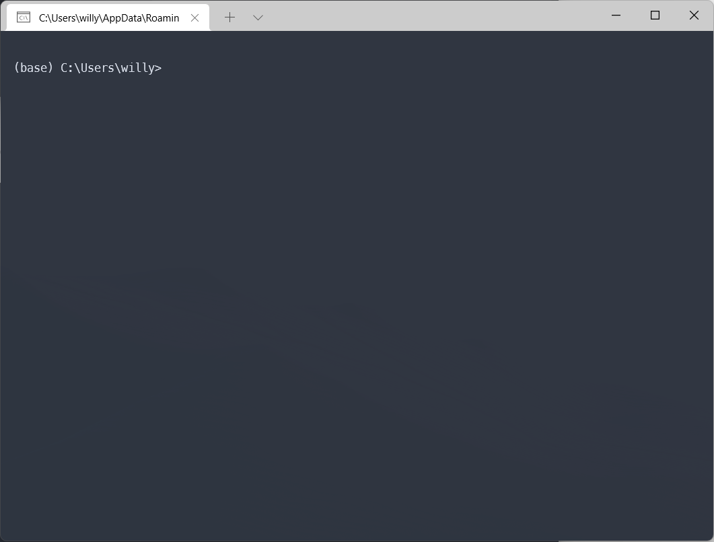
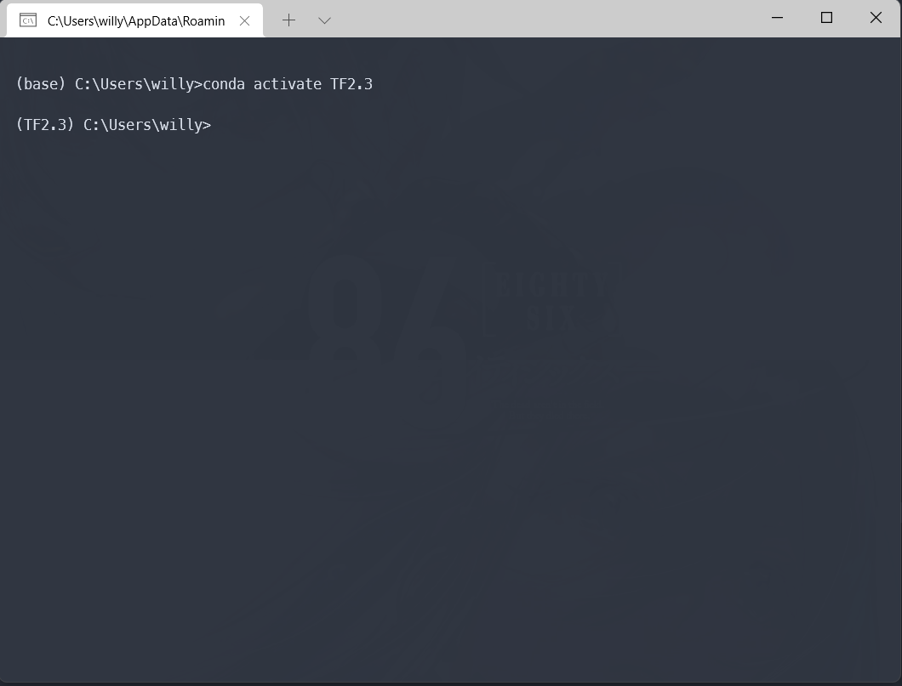

export const ref = {
  anaconda: {
    name: "Anaconda",
    url: "https://www.anaconda.com/products/individual",
  },
  tensorflow: {
    name: "Tensorflow",
    url: "https://www.tensorflow.org/?hl=zh-tw",
  },
  condaCreate: {
    name: "用 conda 建立及管理 python 虛擬環境",
    url: "https://medium.com/python4u/%E7%94%A8conda%E5%BB%BA%E7%AB%8B%E5%8F%8A%E7%AE%A1%E7%90%86python%E8%99%9B%E6%93%AC%E7%92%B0%E5%A2%83-b61fd2a76566",
  },
};

#### 前言

由於在這學期有修了**深度學習概論**的課程，會使用到 <a href={ref.tensorflow.url} children={ref.tensorflow.name}/> 來實作。
所以透過這篇文章來記錄筆者安裝的過程。

環境如下：

- Windows 11 家用版
- Python：3.7.0
- Tensorflow：2.3.0

---

#### 安裝

1. 首先，先至 <a href={ref.anaconda.url} children={ref.anaconda.name}/> 的首頁下載並安裝。

2. 安裝完後，透過 Windows 的搜尋功能打 `Anaconda Prompt`，打開後會跳出 Terminal。
   
   

3. 接著就可以開始建立新的虛擬環境了！

   ```shell
   # 查看當前所有的虛擬環境
   conda env list

   # 建立新的虛擬環境
   conda create --name <虛擬環境的名稱> python=3.7
   ```

4. 完成後按照下方所示，進入剛剛建立好的虛擬環境。

   ```shell
   # 進入虛擬環境
   conda activate <虛擬環境名稱>

   # 離開虛擬環境
   conda deactivate
   ```

   

   > 可以看到前方括號變為你剛剛所建立的虛擬環境名稱，就表示成功進入了。

5. 開始安裝 Tensorflow 2.3.0 版本！

   ```shell
   # 安裝 Tensorflow
   pip install tensorflow==2.3.0

   # 查看所有安裝的套件，看有沒有安裝成功
   pip list

   # 安裝 Jupyter Notebook、Pandas、Numpy 等相關套件
   pip install jupyter
   pip install pandas
   pip install numpy
   ```

6. 接著就可以開始你的深度學習之旅了！

---

#### 結語

本篇講述如何從零開始安裝 Anaconda 及 Tensorflow 的虛擬環境，
希望讓讀者能輕鬆了解如何安裝、啟動自己的深度學習訓練環境。

---

#### 參考文章

1. <a href={ref.condaCreate.url} children={ref.condaCreate.name} />
